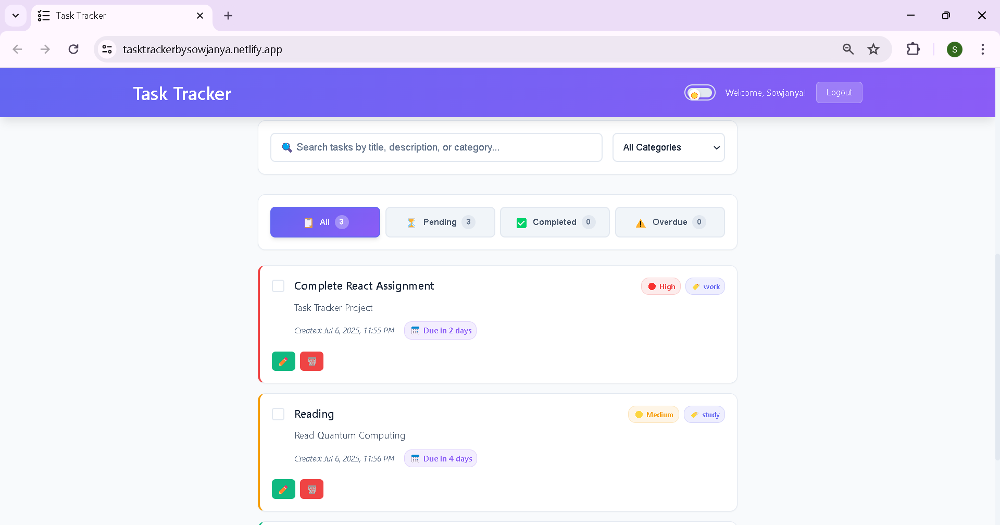
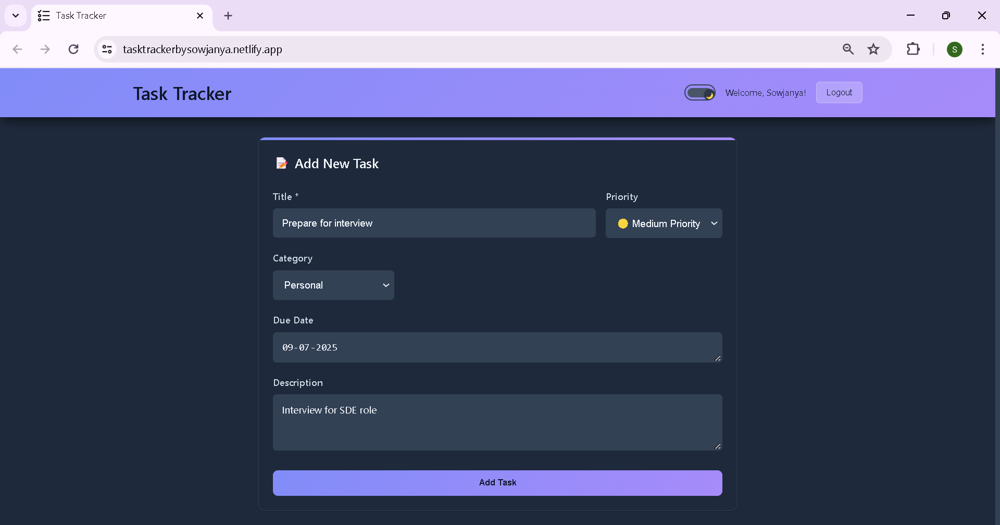
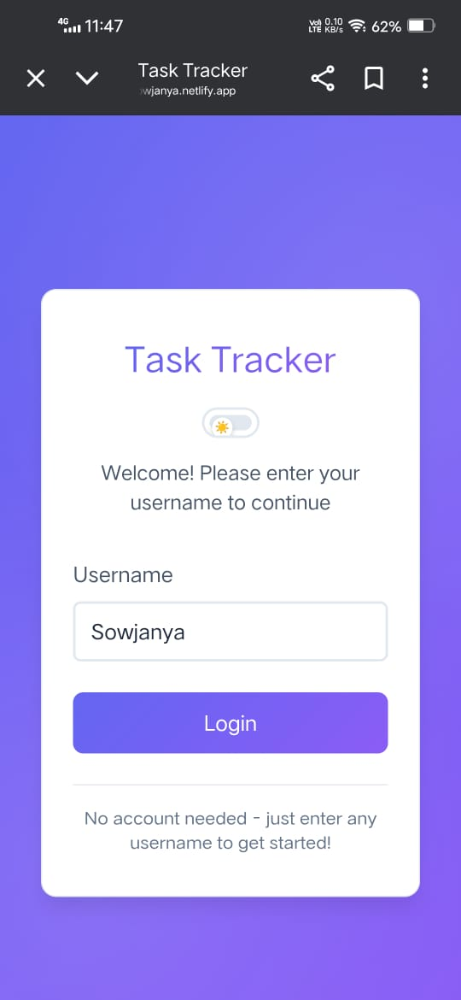
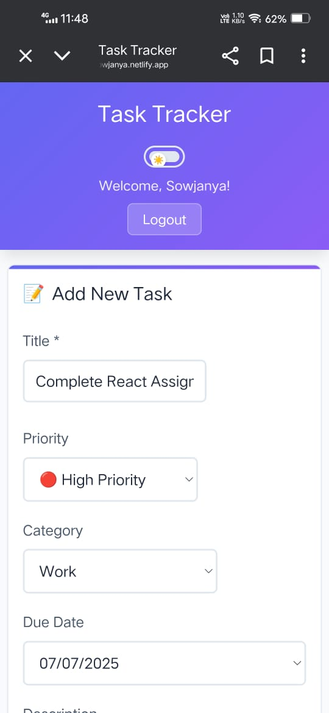
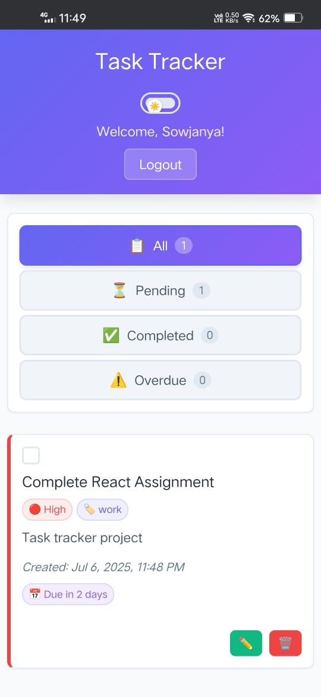

# Personal Task Tracker

A modern, responsive task management application built with React.js that helps you organize and track your daily tasks efficiently.

## 🌟 Features

- **Simple Login System**: Username-based login with localStorage persistence
- **Task Management**: 
  - Add new tasks with title and optional description
  - Edit existing tasks inline
  - Delete tasks with confirmation prompts
  - Mark tasks as complete/incomplete
- **Smart Filtering**: Filter tasks by All, Pending, or Completed status
- **Task Counts**: Real-time count display for each filter category
- **Data Persistence**: All data stored locally using localStorage
- **Responsive Design**: Optimized for both mobile and desktop devices
- **Modern UI**: Clean, intuitive interface with smooth animations
- **Search Tasks**: Real-time search bar to filter tasks by title
- **Task Priority**: Assign priority levels (Low, Medium, High) to each task
- **Due Dates**: Set and display due dates for your tasks
- **Dark Mode**: Toggle between light and dark themes
- **Task Categories/Tags**: Organize tasks by category (e.g., work, personal, study)

## 🚀 Live Demo

[View Live Demo](https://tasktrackerbysowjanya.netlify.app/) 

## 📱 Screenshots

### Desktop View





### Mobile View




## 🛠️ Technologies Used

- **React.js** - Frontend framework
- **React Hooks** - State management (useState, useEffect, useMemo)
- **CSS3** - Styling with modern features (Grid, Flexbox, Animations)
- **localStorage** - Data persistence
- **Responsive Design** - Mobile-first approach

## 📦 Installation & Setup

1. **Clone the repository**
   ```bash
   git clone https://github.com/yourusername/task-tracker.git
   cd task-tracker
   ```

2. **Install dependencies**
   ```bash
   npm install
   ```

3. **Start the development server**
   ```bash
   npm start
   ```

4. **Open your browser**
   Visit [http://localhost:3000](http://localhost:3000) to view the app

## 🏗️ Project Structure

```
task-tracker/
├── public/
│   ├── index.html
│   └── manifest.json
├── src/
│   ├── components/
│   │   ├── Login.js          # Login component
│   │   ├── TaskForm.js       # Add/Edit task form
│   │   ├── TaskItem.js       # Individual task display
│   │   ├── TaskList.js       # Task list container
│   │   ├── TaskFilter.js     # Filter buttons 
│   │   ├── SearchBar.js      # Search tasks using title, category, description
│   │   └── DarkModeToggle.js # Toggle between Light and Dark themes
│   ├── styles/
│   │   ├── Login.css
│   │   ├── TaskForm.css
│   │   ├── TaskItem.css
│   │   ├── TaskList.css
│   │   ├── TaskFilter.css
│   │   ├── SearchBar.css
│   │   └── DarkModeToggle.css
│   ├── utils/
│   │   └── localStorage.js   # localStorage utilities
│   ├── App.js               # Main app component
│   ├── App.css             # Global styles
│   └── index.js            # App entry point
├── README.md
└── package.json
```

## 🎯 Usage

1. **Login**: Enter any username to access the task dashboard
2. **Add Tasks**: Use the form to add title, description, priority, due date, and category
3. **Manage Tasks**: 
   - Click the checkbox to mark complete/incomplete
   - Edit or delete using action buttons
   - Search Tasks: Use the top search bar to filter tasks by title
4. **Filter Tasks**: Use the filter buttons to view All, Pending, Completed or Overdue tasks
5. **Logout**: Click the logout button to return to the login screen

## 🔧 Available Scripts

- `npm start` - Runs the app in development mode
- `npm test` - Launches the test runner
- `npm run build` - Builds the app for production
- `npm run eject` - Ejects from Create React App (one-way operation)

## 📱 Responsive Design

The application is fully responsive and optimized for:
- **Desktop**: Full-featured layout with side-by-side components
- **Tablet**: Adapted layout with proper spacing
- **Mobile**: Stacked layout with touch-friendly interactions

## 🎨 Design Features

- **Modern Gradient Backgrounds**: Eye-catching color schemes
- **Smooth Animations**: Subtle transitions and hover effects
- **Intuitive Icons**: Clear visual indicators for actions
- **Consistent Typography**: Readable fonts with proper hierarchy
- **Accessible Design**: Proper focus states and color contrast

## 🔒 Data Storage

All data is stored locally in your browser using localStorage:
- **Username**: Persisted across sessions
- **Tasks**: Complete task data including titles, descriptions, completion status, and creation dates
- **No Server Required**: Everything runs client-side

## 🚀 Deployment

This app can be easily deployed to:
- **Netlify**: Drag and drop the build folder
- **Vercel**: Connect your GitHub repository
- **GitHub Pages**: Use the gh-pages package

### Deploy to Netlify
1. Run `npm run build`
2. Drag the `build` folder to [Netlify](https://netlify.com)
3. Your app is live!

## 🤝 Contributing

1. Fork the repository
2. Create a feature branch (`git checkout -b feature/amazing-feature`)
3. Commit your changes (`git commit -m 'Add amazing feature'`)
4. Push to the branch (`git push origin feature/amazing-feature`)
5. Open a Pull Request

## 👨‍💻 Author

**Your Name**
- GitHub: [@SowjanyaVangari23](https://github.com/SowjanyaVangari23)
- LinkedIn: [sowjanya-vangari-61772526b](https://linkedin.com/in/sowjanya-vangari-61772526b)

## 🙏 Acknowledgments

- React.js team for the amazing framework
- Create React App for the project setup
- Icons and inspiration from modern task management apps

---

**Happy Task Tracking! 📝✅**